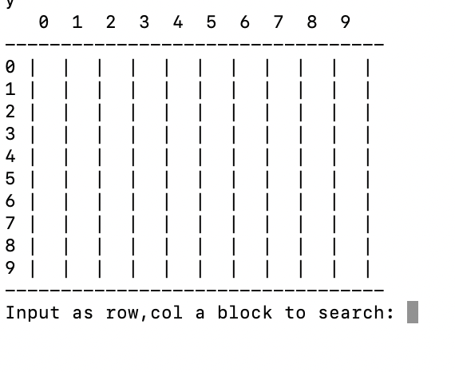
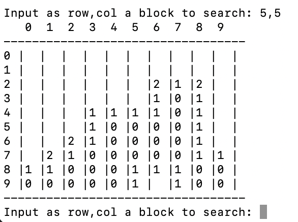

# Minesweeper

Congratulations! You have made it to the final project for the WeThinkCode_ Bootcamp.

Your next task is to take on a group project.

Your project is "Minesweeper", to find out more about this game or to play it a little bit for "research" purposes go to: [MinesweeperOnline.com](http://minesweeperonline.com/)


## Introduction

The most successful game ever made isn't World of Warcraft, Tetris or even

The Sims

.

Click-for-click, nothing has wasted more time than Minesweeper, a little game that debuted back in 1990 as part of the Windows Entertainment Pack, before being promoted to a standard feature in Windows 3.1 and onwards.

Minesweeper was a Microsoft original, written by Robert Donner and Curt Johnson, and hasn't changed much over the years.

In the unlikely event you've never played it, the gist is that you start with an empty field (its size and number of mines determined by difficulty setting) and have to uncover squares one at a time. Underneath each is either a space, a number, or a mine. The numbers tell you how many mines are in the adjacent boxes, the mines kill you dead. To win, you have to clear the field without touching a mine. It's a relatively simple game of deduction, but satisfying.

[Source: Tech Radar](https://www.techradar.com/news/gaming/the-most-successful-game-ever-a-history-of-minesweeper-596504)

## Objectives

The idea is to get you to see the possibilities with Python and the Command Line. You have gone through all the exercises and now we must determine if you can apply all the concepts with your own Problem Solving skills.

Therefore, we wish to remind you, this is **NOT a MATH Problem** but rather a Problem Solving question.

## Instructions

- You are expected to design a function or multiple functions that will recreate the famed game Minesweeper.
- The board for the game must be taken in as input. The board must be square with validations to ensure its dimensions cannot be less that size 16 i.e 4x4.
- The number of bombs must be taken in as input and cannot exceed the total dimensions of the board i.e bombs < squares
- The placement of the bombs should be random on every new iteration of gameplay. (When a new game starts, don't move the bombs when people are playing)
- The game must display when the User has Won! This happens when all the squares have been opened without detonating a bomb.
- The game must display when a User has lost. This happens when they have stepped on a bomb.
- The game may look in any way that you wish but our recommendation is shown below (easiest to implement)

- You may take input in any method you wish but we would recommend a row & column system.

- You are given the function 'play', instantiated as:

    ```python
    def play(dim_size, num_bombs):

    ```

- This function is the only function we will call to play the game. Edit its contents as you wish.

Good Luck!

## Mandatory

- You must print the Game Board
- You must update the board after all valid input
- You must have a method to handle invalid input
- You must have a Winning Condition / Losing Condition

### Bonus

After a Winning or Losing condition, allow a player to return to a Welcome Screen offering an opprtunity to try again.

Create a Scoreboard system that can be viewed from the game.

Let the scoreboard system be written to a file and loaded on each gameplay with a Player Name and Score.
